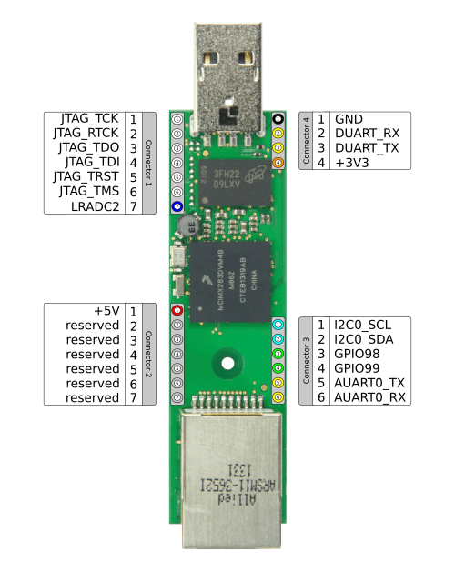

Pin muxing
==========

Some of the pins of the Duckbill connectors can be used for multiple purposes
and/or share functionality with other peripherals, e.g. SD card socket. This
BSP configures the IO pin muxing according to the following image:

